# EXTERNAL PAGINATION SERVICE

Implementation Project with :
- Functionality
- Code Structure
- API Design 
- Error Handling
- Performance Optimization (Caching)

---
## System Requirements
- Java OpenJDK : version 17.0.2
- Spring Boot : version 3.5.7
- Maven : Apache Maven 3.9.3
- Editor : Intellij IDEA 2023.1.1 Community Edition
- Tools: Postman

---
## Dependencies
- Spring Web - spring-boot-starter-web
- Spring Boot DevTools - spring-boot-devtools
- Caching - caffeine
- Jackson / JSON parser - jackson-databind
- Swagger - springdoc-openapi-starter-webmvc-ui
- lombok

---
## Configuration (application.yaml) :

### External Api
Mock API using DummyJSON with total user data = 208.

Default endpoint without parameters returns 30 data items:
```
https://dummyjson.com/users
```

To fetch all data, use:
```
https://dummyjson.com/users?limit=208&skip=0
```
or
```
https://dummyjson.com/users?limit=0&skip=0
```

<p>
  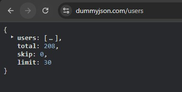
</p>


### Cache Configuration
```yaml
- expire-after-write-minutes: 10
- maximum-size: 1
```
Explanation:
- expire-after-write-minutes: Cache data expires after 1 minute
- maximum-size = 1: Only stores 1 key


### Full application.yaml
```
spring:
  application:
    name: external-pagination-service

external-api:
  url: https://dummyjson.com/users?limit=208&skip=0

cache:
  users:
    expire-after-write-minutes: 1
    maximum-size: 1

springdoc:
  api-docs:
    path: /api/users/v3/api-docs
  swagger-ui:
    path: /swagger-ui.html
    enabled: true

logging:
  level:
    root: INFO
    com.blackcode.external_pagination_service: DEBUG
```

---
## Build & Run Project

Build Project
```
mvn clean install
```

Run Project
```
mvn spring-boot:run
```

---
## Api Endpoint : User
Base URL: localhost:8080

Method  | Endpoint   | Description
--------|------------|------------------------------
GET     | /api/users | Get All User

### Query Parameters

Parameter  | Type | Default |Description
--------|------|---------|----------------------
page     | int  | 1       | The page number
size     | int  | 10      | Number of items per page

---
## Example Result :

- Get All Users without query parameter

default value page = 1

default value size = 10

Request
``` 
GET /api/users
```
Response
<p align="center">
  
</p>

- Get All Users with parameter size (208 users)

Request
``` 
GET /api/users?size=208
```
Response
<p align="center">
  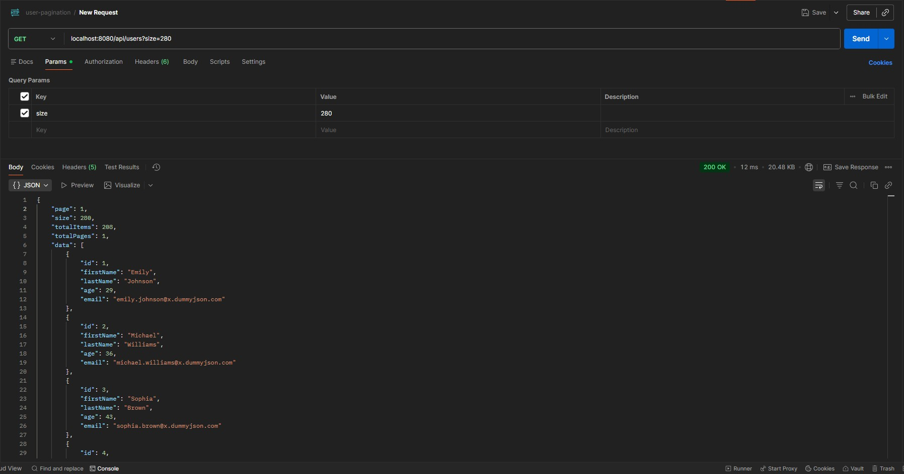
</p>


- Get Data User with parameter page & size

Request
``` 
GET /api/users?page=2&size=10
```

Response
<p align="center">
  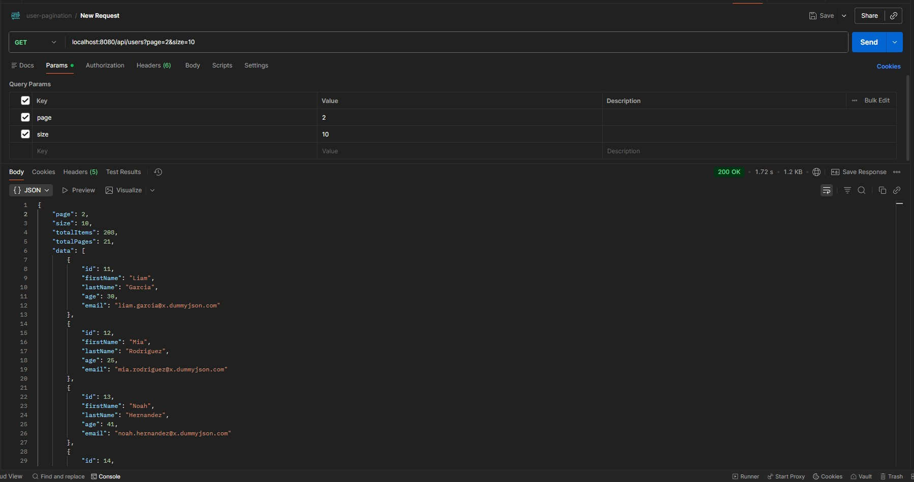
</p>


- Get Data User With filtering by name

Request
``` 
GET /api/users?name=John
```

Response
<p align="center">
  
</p>

---
## Error Handling 

- Error Handling – Invalid Pagination Parameter

Request
``` 
GET /api/users?page=2&size=0
```

Response
<p align="center">
  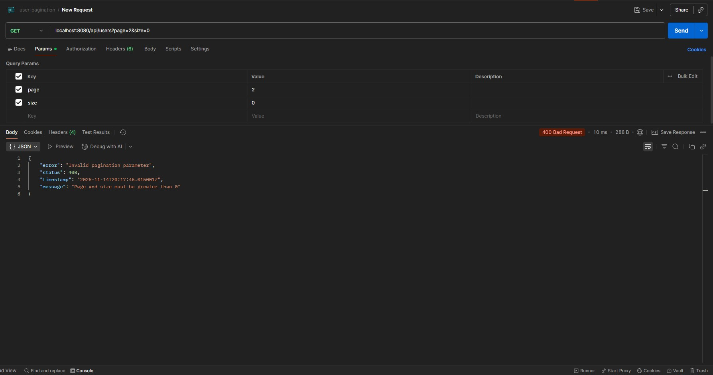
</p>


Request
``` 
GET /api/users?page=2&size=-5
```

Response
<p align="center">
  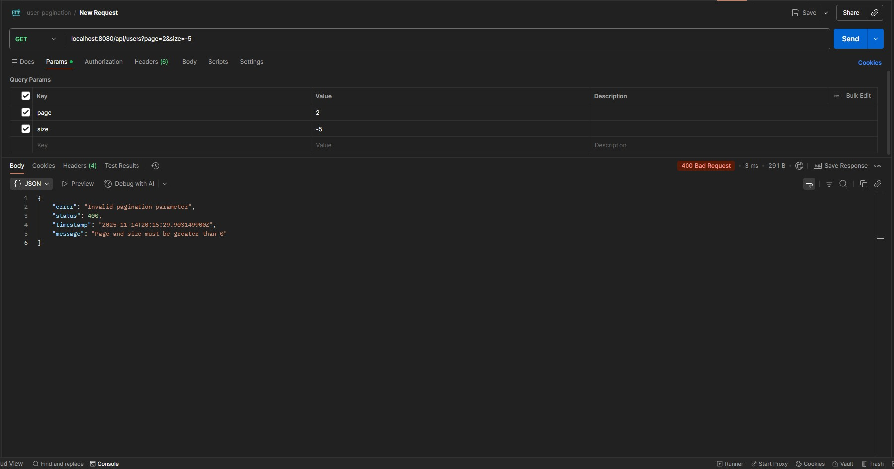
</p>


- Error Handling – External API Error
  When the external API is down or unreachable.

Request
``` 
GET /api/users?page=2&size=10
```

Response
<p align="center">
  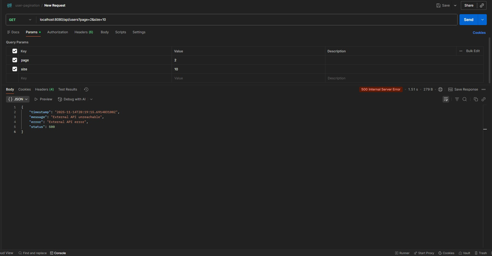
</p>

---
## Example Result Performance (Using Caching):

- Request 1 – Fetch from External API

Request
``` 
GET /api/users?size=208
```
Response
<p align="center">
  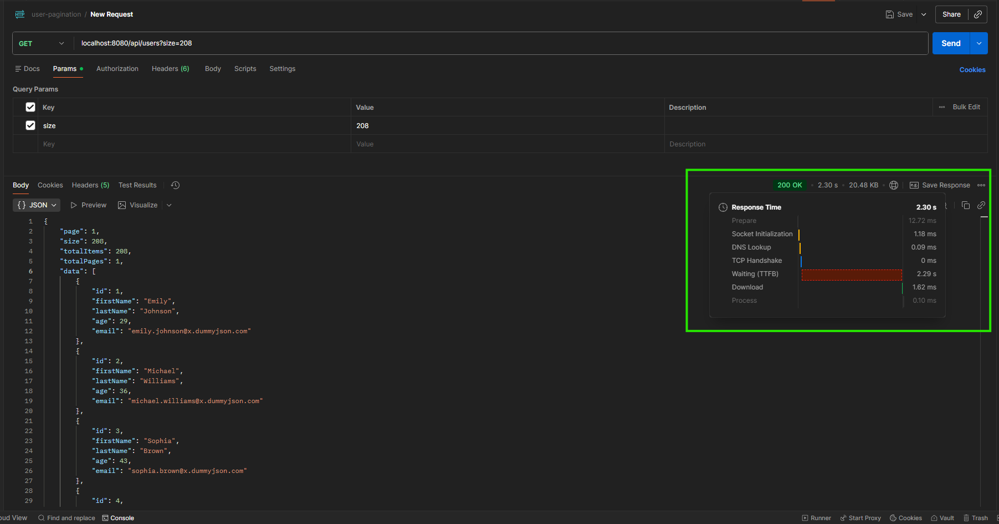
</p>

Response Time : 2.30 s


Request
``` 
GET /api/users?page=2&size=10
```
Response
<p align="center">
  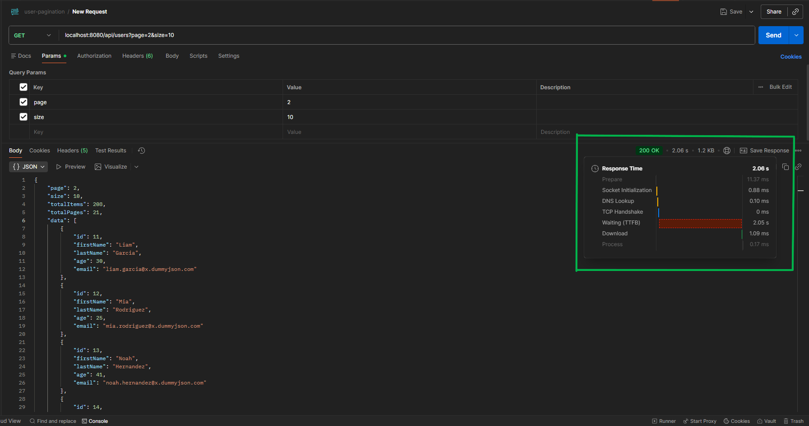
</p>

Response Time : 2.06 s

Log :
<p align="center">
  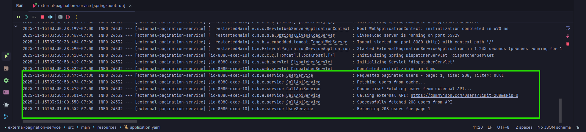
</p>

- Request 2, 3, ... – Fetch from Cache

Request
``` 
GGET /api/users?size=208
```

Response
<p align="center">
  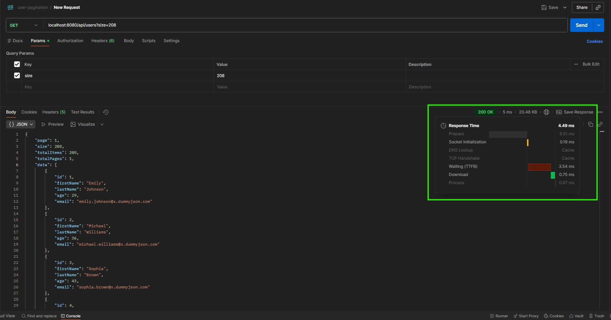
</p>

Response Time : 4.49 ms

Request
``` 
GET /api/users?page=2&size=10
```
Response
<p align="center">
  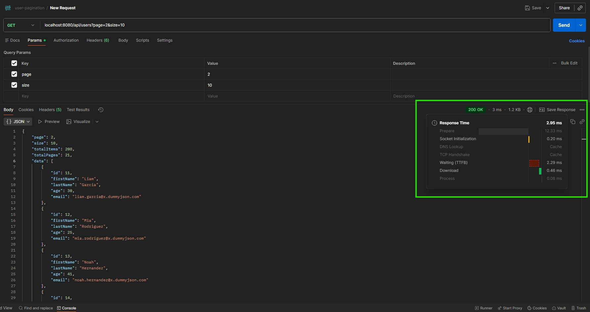
</p>

Response Time : 2.95 ms

Log :
<p align="center">
  
</p>

Result :

Scenario                       | From Api (Response Time) | Cache (Response Time)
------------------------------ |--------------------------|--------
GET /api/users?size=208        | 2.30 s                   | 4.49 ms
GET /api/users?page=2&size=10  | 2.06 s                   | 2.95 ms

---
## Swagger UI
- Access Swagger UI at:
```
http://localhost:8080/swagger-ui/index.html
```

<p align="center">
  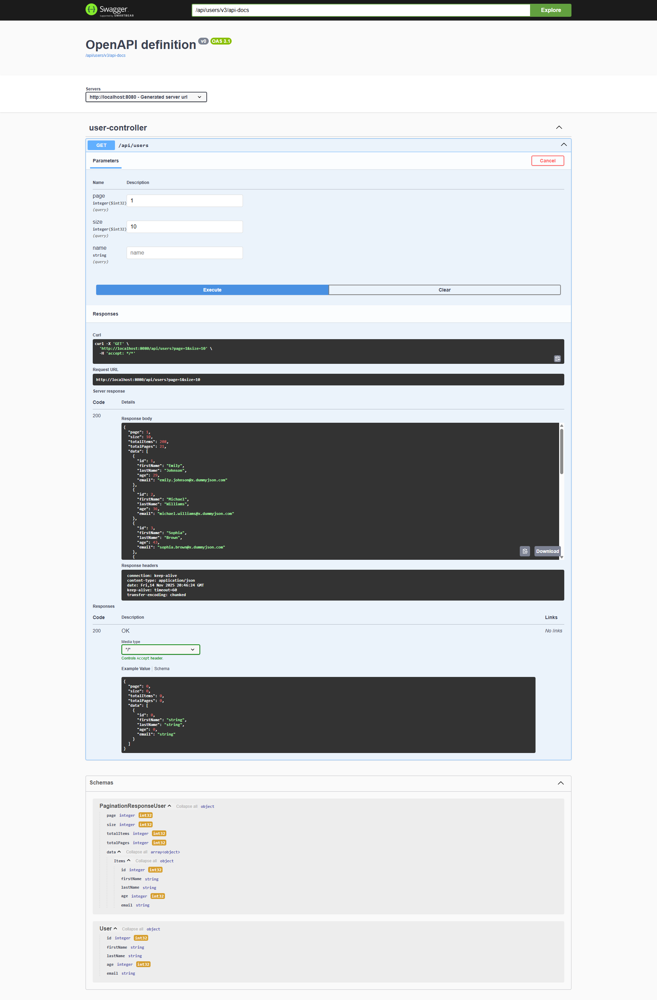
</p>


			